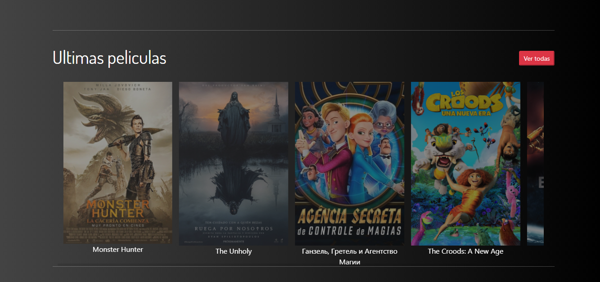

# Angular - Consumo API REST MovieDB - Bootstrap 5 - SwiperJS, Ng Star Rating  

## Descripción:
Consumo de una API REST (MovieDB), la cual cuenta con una gran colección de películas, series, actores entre otros datos más.

## Caracteristicas:
1. Slider de ultimas películas.
2. Listado de ultimas películas.
3. Listado de películas top.
4. Listado de series en emisión.
5. Carrusel de películas y series.
6. Descripción detallada de la serie o película seleccionada.
7. Búsqueda de series y películas

## Secciones
1. Inicio.
2. Peliculas.
3. Peliculas Top.
4. Series en emision.

## Capturas

### Inicio

### Inicio - Top películas

### Inicio Ultimas películas

### Películas

### Películas mejores calificadas

### Series en emisión

### Detalles de serie seleccionada

### Información de temporadas

### Casting de la serie

### Resultados de búsqueda

### Sin resultados de búsqueda

## Demo
https://nervous-mcclintock-3bde95.netlify.app